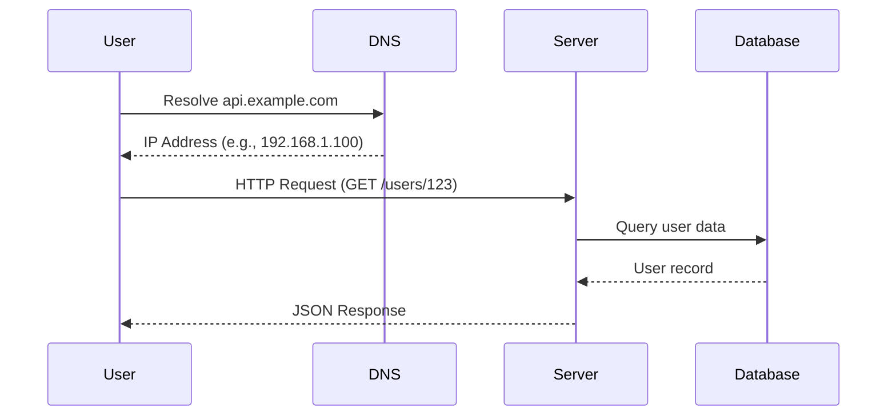
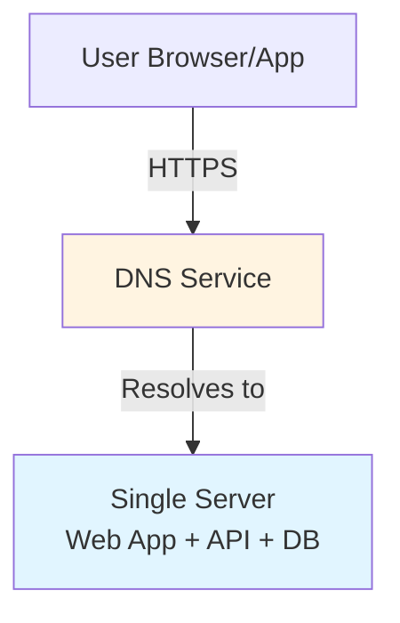

# Request Flow and Basic Architecture (Part 1)

## Understanding Request Flow

When a user interacts with a web application, a series of steps occur behind the scenes. Understanding this flow is fundamental to system design.

## Basic Request Flow

### Step-by-Step Process

1. **User Initiates Request**: User enters URL in browser or mobile app makes API call
2. **DNS Resolution**: Domain name (e.g., `api.example.com`) is resolved to IP address
3. **HTTP Request**: Browser/app sends HTTP request to the resolved IP address
4. **Server Processing**: Web server processes the request
5. **Response**: Server returns HTML (web) or JSON (API) response
6. **Client Rendering**: Browser renders HTML or app processes JSON

### Visual Flow



### ASCII Fallback

```text
User → DNS (resolve domain) → Server (process request) → Database (fetch data)
                                                              ↓
User ← JSON/HTML Response ← Server ← Query Results ←────────┘
```

## Single-Server Architecture

### Initial Setup

The simplest architecture runs everything on one machine:

**Components on Single Server**:

- Web application code
- API endpoints
- Database
- Static files (HTML, CSS, JavaScript)
- Business logic

### Architecture Diagram



### ASCII Fallback

```text
┌─────────────┐
│   User      │
└──────┬──────┘
       │ HTTPS Request
       ▼
┌─────────────┐
│     DNS     │ (Resolves domain to IP)
└──────┬──────┘
       │
       ▼
┌──────────────────────────────┐
│      Single Server           │
│  ┌────────────────────────┐  │
│  │  Web Application      │  │
│  │  API Endpoints         │  │
│  │  Database              │  │
│  │  Static Files          │  │
│  └────────────────────────┘  │
└──────────────────────────────┘
```

### Characteristics

**Advantages**:

- ✅ Simple to develop and deploy
- ✅ Low operational overhead
- ✅ Cost-effective for small scale
- ✅ Easy to understand and debug

**Limitations**:

- ❌ Single point of failure
- ❌ Limited scalability
- ❌ Resource contention (CPU, memory, I/O)
- ❌ Performance degrades with traffic

**When to Use**:

- Prototypes and MVPs
- Learning and development
- Very low traffic (< 1K users)
- Proof of concept systems

---

*Next: [Request Flow and Basic Architecture (Part 2)](./07_request-flow-and-basic-architecture-part2.md) - Separating components and scaling considerations.*

