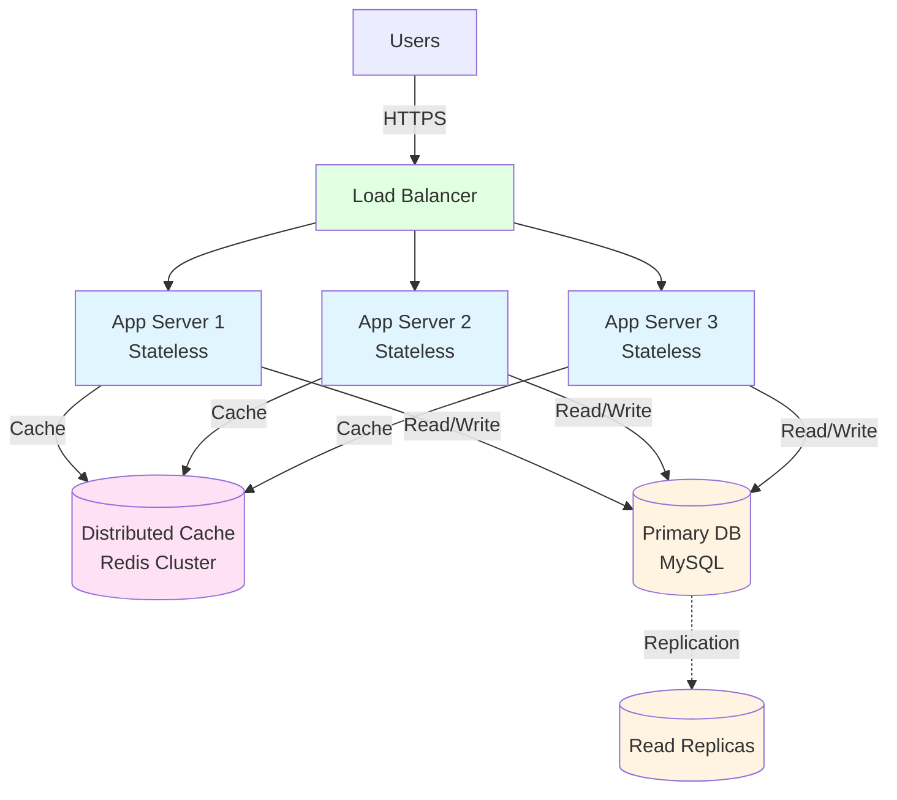

# Phase 3: Horizontal Scaling (100K-1M Users)

## Architecture Overview

This diagram illustrates the horizontal scaling architecture used once a single application server becomes a bottleneck.



## ASCII Fallback

```text
┌────────┐
│ Users  │
└───┬────┘
    │ HTTPS
    ▼
┌──────────────┐
│ Load Balancer│
└───┬─────┬────┘
    │     │
    ▼     ▼
┌───────────┐  ┌───────────┐   (N instances)
│ App Svc 1 │  │ App Svc 2 │
│ Stateless │  │ Stateless │
└────┬──────┘  └────┬──────┘
     │              │
     ├──────┬───────┤
     ▼      ▼       ▼
  ┌──────────────────────┐
  │ Distributed Cache     │ (Redis Cluster)
  └───────────┬──────────┘
              │
              ▼
        ┌───────────┐
        │ Primary DB │
        └─────┬─────┘
              │ Replication
              ▼
        ┌────────────┐
        │ Read Replica│
        └────────────┘
```

## Components

### Load Balancer

- Distributes requests across multiple application servers
- Performs health checks and removes unhealthy instances
- Enables horizontal scaling by adding/removing instances

### Application Servers

- **Stateless**: Session/state stored externally (e.g., cache)
- **Horizontally scalable**: Add more instances to increase capacity
- **Failure tolerant**: Instance loss reduces capacity, not availability

### Distributed Cache

- Shared cache for frequently accessed data
- Reduces database load and improves latency
- Must handle cache invalidation and consistency trade-offs

### Database Layer

- Primary database handles writes
- Read replicas can scale read-heavy workloads
- Database may become next bottleneck at higher scale

## Characteristics

- ✅ Scales by adding app instances
- ✅ Higher availability (no single app server SPOF)
- ✅ Better throughput and resilience
- ❌ Operational complexity increases (deployments, monitoring, autoscaling)
- ❌ Distributed cache consistency becomes important

---

*Previous: [Phase 2: Vertical Scaling](./05_phase2-vertical-scaling.md)*
