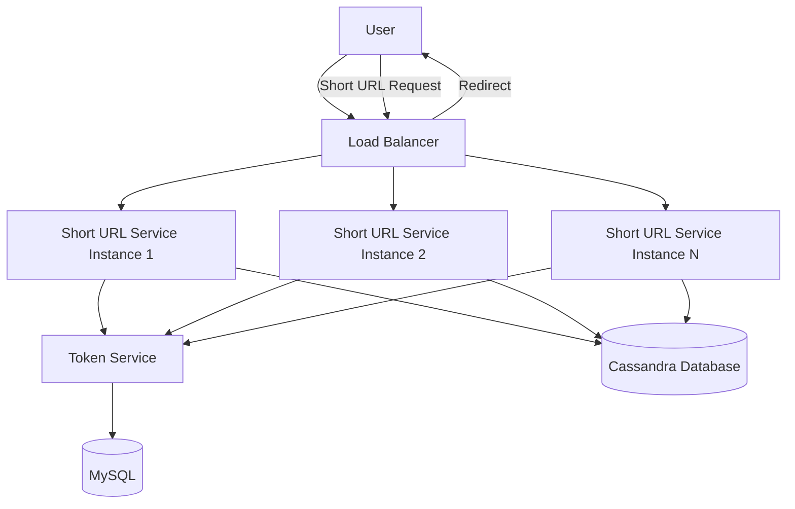

# URL Shortener - High-Level Design

## System Architecture Overview

The URL shortening service consists of two main flows:

1. **Shortening Flow**: Convert long URL to short URL
2. **Redirection Flow**: Resolve short URL to long URL and redirect

## Core Components

### 1. Load Balancer
- Distributes incoming requests across multiple service instances
- Ensures high availability and load distribution

### 2. Short URL Service
- **Multiple Instances**: Horizontally scalable service instances
- **Responsibilities**:
  - Generate unique short URL identifiers
  - Store URL mappings (short URL → long URL)
  - Retrieve URL mappings for redirection

### 3. Token Service
- **Purpose**: Generate unique numeric identifiers for short URLs
- **Operation**: Assigns ranges of unique numbers to each service instance
- **Characteristics**:
  - Low-frequency service (called only when service instances need new token ranges)
  - Ensures no collisions between service instances
  - Built on relational database (MySQL) for ACID guarantees

### 4. Database
- **Primary Storage**: Stores short URL to long URL mappings
- **Choice**: Columnar database (Cassandra) for:
  - High write throughput
  - Horizontal scalability
  - Efficient storage of large number of records
- **Alternative**: Sharded relational database (MySQL) can also work

## Architecture Diagram

## Request Flows

### Shortening Flow

1. User submits long URL through UI
2. Load balancer routes request to available Short URL Service instance
3. Service instance requests token range from Token Service (if needed)
4. Service generates short URL from token
5. Service stores mapping (short URL → long URL) in database
6. Service returns short URL to user

### Redirection Flow

1. User accesses short URL
2. Load balancer routes request to available Short URL Service instance
3. Service queries database for long URL
4. Service returns HTTP redirect (301/302) to long URL
5. User's browser follows redirect to original URL

## Key Design Decisions

### Why Token Service Instead of Centralized Counter?

**Problem with Centralized Counter (Redis)**:
- Single point of failure
- Performance bottleneck (all instances hit same Redis)
- Difficult to scale beyond single Redis capacity

**Solution: Token Range Assignment**:
- Each service instance gets a range of unique tokens
- Instances generate short URLs independently from their assigned range
- Token Service only called when range is exhausted (low frequency)
- No collisions possible (ranges don't overlap)

### Why Cassandra for Primary Storage?

- **Scale**: Can handle billions of URL mappings
- **Write Performance**: Optimized for high write throughput
- **Horizontal Scalability**: Easy to add more nodes
- **Alternative**: Sharded MySQL also viable but requires more operational complexity

---

*For detailed implementation of token generation and service design, see [Low-Level Design](./low-level-design.md).*
